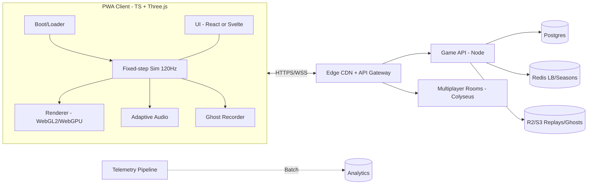

# METRO SURGE — AAA Subway-Style Endless Runner for Web
### Product Requirements Document (PRD)

| Field | Detail |
|---|---|
| **Product name (working title)** | METRO SURGE: Neon Odyssey |
| **Tagline** | "Outrun the city. Own the rails." |
| **Genre** | 3D Endless Runner / Arcade Action |
| **Platform** | Web-first (desktop + mobile browser), PWA-installable |
| **Engine (proposed)** | Custom Web Engine: TypeScript + Three.js (WebGL2 + WebGPU progressive enhancement) |
| **Business model** | Free-to-Play, cosmetics-only monetization + Battle Pass + rewarded ads |
| **Target rating** | E10+ / PEGI 7 |
| **Version** | PRD v1.0 — 2026-09-11 |
| **Status** | Draft for review |
| **Owner** | Product / Game Design |
| **Repo** | `FFSenseAI` — this document is the source of truth for scope |

---

## Table of Contents

1. [Executive Summary](#1-executive-summary)
2. [Vision, Goals & Non-Goals](#2-vision-goals--non-goals)
3. [Target Audience & Personas](#3-target-audience--personas)
4. [Competitive Analysis](#4-competitive-analysis)
5. [Product Pillars (What makes it AAA)](#5-product-pillars-what-makes-it-aaa)
6. [Game Overview](#6-game-overview)
7. [Core Gameplay & Mechanics](#7-core-gameplay--mechanics)
8. [Controls (Web-Native)](#8-controls-web-native)
9. [Game Modes](#9-game-modes)
10. [Worlds, Tracks & Level Generation](#10-worlds-tracks--level-generation)
11. [Characters, Boards & Customization](#11-characters-boards--customization)
12. [Power-Ups, Boosters & Economy](#12-power-ups-boosters--economy)
13. [Missions, Progression & Meta Game](#13-missions-progression--meta-game)
14. [Social, Multiplayer & LiveOps](#14-social-multiplayer--liveops)
15. [UI/UX Requirements](#15-uiux-requirements)
16. [Art Direction & Graphics Bar](#16-art-direction--graphics-bar)
17. [Audio & Music](#17-audio--music)
18. [Technical Requirements](#18-technical-requirements)
19. [Web Performance Budgets](#19-web-performance-budgets)
20. [Backend & Services Architecture](#20-backend--services-architecture)
21. [Security, Anti-Cheat & Fair Play](#21-security-anti-cheat--fair-play)
22. [Accessibility (a11y)](#22-accessibility-a11y)
23. [Localization & Compliance](#23-localization--compliance)
24. [Analytics, Telemetry & KPIs](#24-analytics-telemetry--kpis)
25. [Monetization Design](#25-monetization-design)
26. [Scope: MVP → V1 → V2 (MoSCoW)](#26-scope-mvp--v1--v2-moscow)
27. [User Stories & Acceptance Criteria (MVP)](#27-user-stories--acceptance-criteria-mvp)
28. [Milestones & Roadmap](#28-milestones--roadmap)
29. [Team & Roles (Suggested)](#29-team--roles-suggested)
30. [Risks & Mitigations](#30-risks--mitigations)
31. [Open Questions](#31-open-questions)
32. [Appendix A: Obstacle & Pattern Library](#appendix-a-obstacle--pattern-library-starter)
33. [Appendix B: Track Generation Algorithm](#appendix-b-track-generation-algorithm-sketch)
34. [Appendix C: API Sketch](#appendix-c-api-sketch)
35. [Appendix D: Asset Budget](#appendix-d-asset-budget)

---

## 1. Executive Summary

**METRO SURGE** is a AAA-quality, Subway Surfers-style 3D endless runner built **natively for the browser** — no install, no plugin, playable in under 5 seconds from a link.

Inspired by Subway Surfers' pick-up-and-play chase fantasy, we elevate every dimension to a premium, console-like feel on web:

- **Cinematic 3D city worlds** with dynamic lighting, weather, day/night, crowds, and physics-driven set pieces (collapsing scaffolds, shattering crates, train near-misses with slow-mo).
- **Deep, skill-based movement**: 3-lane dodge + jump + slide + wall-run + grind + vault, with buttery 60–120 FPS controls tuned for keyboard, touch, and gamepad.
- **Real progression**: characters, hoverboards, suits, missions, seasons, Battle Pass, clans, leaderboards, and story-driven World Tour cities.
- **Multiplayer from day one (async) and real-time races in V1**: ghost rivals, 8-player Rail Rumble, weekly tournaments.
- **Web-superpowers**: instant link sharing, PWA install, cloud saves, cross-device resume, embeddable challenges, Discord/YouTube-ready clip capture.

**Why now / why web:** install friction kills arcade discovery. A link-playable AAA runner can go viral on socials, classrooms, and gaming portals (Poki/CrazyGames-tier distribution) while still monetizing via cosmetics + pass. WebGL2 is universal; WebGPU unlocks near-native visuals on flagship devices.

**MVP promise (8–12 weeks):** one jaw-dropping city (Neo Mumbai), 1 endless mode + daily seed challenge, 4 runners + 4 boards, full move set, missions, local + cloud profile, leaderboards, 60 FPS on mid-tier devices, < 40 MB initial load.

---

## 2. Vision, Goals & Non-Goals

### Vision
> Be the best-feeling, best-looking runner ever shipped to a URL — the game people send to friends with "bro you have to try this in your browser."

### Product Goals (12 months post-launch)
| # | Goal | Measurable target |
|---|---|---|
| G1 | Instant fun | Median time-to-first-run < 8s on 4G; D1 retention ≥ 35% |
| G2 | AAA feel on web | ≥ 90% of sessions at stable 60 FPS (Performance Mode); crash rate < 0.5% |
| G3 | Retention engine | D7 ≥ 18%, D30 ≥ 8%; ≥ 3 sessions/week for active players |
| G4 | Social virality | K-factor ≥ 0.3 via challenge links + ghosts; 20% of new users from shares |
| G5 | Sustainable monetization | ≥ 4% payers by month 6, ARPPU ≥ $8/season, zero pay-to-win complaints trend |
| G6 | LiveOps cadence | New season/city every 6–8 weeks; weekly events without client update |

### Non-Goals (for MVP/V1)
- Native mobile apps / Steam / console ports (web-first; wrappers only in V2).
- UGC track editor (considered for V2; design hooks now, build later).
- Voice chat, trading, NFTs/crypto, or pay-to-win boosters — explicitly out.
- Full open-world exploration — this is a curated runner, not GTA.

---

## 3. Target Audience & Personas

| Persona | Who | Needs | How we win |
|---|---|---|---|
| **Arjun, 14 — The Playground Pro** | Mobile-first, plays on school Chromebook + phone. Loves Subway Surfers, Stumble Guys. | Instant play, cool skins, beat friends' scores, works on weak hardware. | Link-playable, Performance Mode, ghosts vs friends, free cosmetics grind. |
| **Maya, 24 — The Commute Grinder** | Plays 10-min sessions on laptop/phone. Battle-pass buyer in other games. | Meaningful progression, daily challenges, pretty worlds. | Daily seeds, missions, seasons, 120 FPS + photo mode on desktop. |
| **Leo, 29 — The Speedrunner/Streamer** | Desktop + gamepad, streams arcade games. | Skill ceiling, tournaments, clips, leaderboards. | Advanced movement tech (wall-run cancels, perfect grinds), seed racing, clip capture + OBS-friendly overlays. |
| **Coach Dan, 35 — Portal/Brand Partner** | Runs a gaming portal / brand campaign. | Embeddable, brand-safe, white-label events. | oEmbed + iframe SDK, sponsored city skins, moderated leaderboards. |

**Primary markets:** India, US, Brazil, UK, Indonesia (strong runner + web-gaming overlap). **Age:** 10–34 core. **Devices:** 60% mobile browser / 40% desktop browser at launch (assumption to validate).

---

## 4. Competitive Analysis

| Game | Strengths | Weaknesses / Our opening |
|---|---|---|
| **Subway Surfers** | Perfect core loop, iconic chase, World Tour content machine. | Dated visuals, native-install only, shallow movement, aggressive ads. → We do "Surfers at 10x fidelity, in a link." |
| **Temple Run 2** | Great turns/swipes, strong brand. | Single-theme fatigue, no social depth. → We do seasons + cities + multiplayer. |
| **Sonic Dash / Crash on the Run** | IP power, polish. | IP-locked, delisted/sunset risk, install walls. → We do original IP, web-native, evergreen. |
| **Web runners (Poki/CrazyGames clones)** | Zero friction, huge SEO traffic. | Ugly, janky, ad-stuffed, no progression. → We do AAA bar + retention + fair monetization. |
| **Fall Guys / Stumble Guys** | Party chaos, seasons. | Not a runner; heavy clients. → We borrow seasons + party modes, keep it lightweight. |

**Differentiators (must be obvious in 30 seconds):**
1. Looks and feels AAA *in a browser tab*.
2. Movement depth (grind/wall-run/vault chaining) with slow-mo near-miss moments.
3. One-tap rival ghosts + shareable seed challenges.
4. A living city: weather, day/night, crowds, events — every run feels alive.

---

## 5. Product Pillars (What makes it AAA)

1. **Feel is everything** — 120 Hz-ready input, coyote time, input buffering, screen shake, FOV kick, slow-mo, haptics. If it doesn't feel amazing, it doesn't ship.
2. **A city that breathes** — dynamic lighting/weather/crowds/traffic AI, set-piece moments, adaptive music. No two runs feel identical.
3. **Skill you can show off** — trick chains, perfect grinds, near-miss bonuses, ranked races, clips. Depth for grinders, fun for casuals.
4. **Progress that respects you** — generous free track, cosmetics-only paid, no energy timers blocking runs. Pay for style, not power.
5. **Built for the link** — instant load, PWA, shareable everything, embeddable, works on a Chromebook.

---

## 6. Game Overview

**Fantasy:** You're a crew of rail-runners outrunning the Inspector's security drones through a neon-soaked mega-city. Vault turnstiles, grind power lines, wall-run billboards, surf trains — and escape with style.

**Core loop (60–180s sessions):**
```
HOME (play in 1 tap) → RUN (dodge/grind/trick, chase heat rises)
  → CRASH or CASH-OUT → REWARDS (coins, mission progress, mastery XP)
  → UPGRADE / CUSTOMIZE → SHARE GHOST / REMATCH (one tap)
```

**Session loop (weekly):** Daily Seed → Missions → Weekend Tournament → Season Pass progress → New city vote.

**Chase Heat system (signature twist on Surfers):** the longer you survive, the smarter the pursuit gets — drones cut lanes, barriers deploy, trains reroute. Heat decays with tricks/near-misses. At max Heat: "SURGE MODE" — slow-mo + double score + cinematic camera until you crash or cool down. This replaces pure speed-scaling with drama.

---

## 7. Core Gameplay & Mechanics

### 7.1 Lanes & Movement
- **3 main lanes** (x = -2.2, 0, +2.2m) + temporary **grind rails / wires** (upper layer) + **walls** (side layer during wall-run sections).
- **Base forward speed:** 12 m/s → scales to 26 m/s by ~3 min, then Heat-driven events instead of raw speed (avoids unfairness).
- **Moveset:**

| Move | Input | Notes / Depth |
|---|---|---|
| Lane change | ←/→, swipe, LB/RB | Buffered; double-tap = double-lane dash (i-frames 120ms, cooldown 4s) |
| Jump | ↑/Space/W, swipe up, A | Variable height (hold); coyote time 120ms; jump-buffer 150ms |
| Slide/roll | ↓/S, swipe down, B | Cancels jump descent (fast-fall); extends under barriers |
| Vault | Auto-context (low barrier + forward) or jump at edge | Mantle over turnstiles/crates; preserves momentum |
| Grind | Land on rail/wire | Balance mini-game (micro-steer); perfect zone = boost + score |
| Wall-run | Jump toward wall arrows | Steer + jump to hop walls; chains into grind |
| Stomp | ↓ in air | Slams down, smashes crates, shocks nearby drones (brief slow) |
| Board (active) | E/tap board button | Deploys hoverboard = 1 crash shield + trick moves for 20s |
| Trick | J/L + direction in air / on grind | Backflip, tailgrab, 360 — risk/reward score + Heat vent |

- **Trick/Flow scoring:** chaining moves without touching ground builds a multiplier (x1 → x8). Crashing loses chain; grinding "banks" half of it. Near-misses add +Flow and vent Heat.

### 7.2 Obstacles (families)
1. **Trains** (static, oncoming, moving-same-direction; short/long; with ramps on top).
2. **Barriers** (low vault / high slide / full-block requiring lane change).
3. **Gaps & pits** (jump or grind around).
4. **Scaffolds & billboards** (wall-run walls, collapsing).
5. **Drones & Inspector** (chase AI: lane blocks, sweeps, net shots at high Heat — dodgeable telegraphs).
6. **Traffic & crowds** (moving hazards on street sections; crashing into crowd = stumble not death in casual mode).
7. **Bonus lines** (coin arcs, magnet trails, grind wires with score gates).

Fairness rules: every pattern must have ≥1 solvable path at max speed; telegraphs ≥450ms at top speed; no blind spawns after camera cuts; difficulty ramps via pattern tiers (see Appendix B).

### 7.3 Crash & Recovery
- Crash = lose board (if active) or run ends. **Stumble system (casual assist):** first side-swipe per run = stumble (slow + brief i-frames) instead of death — toggleable in Hardcore/Ranked.
- Revive: 1 free revive per day; else keys (earned) — never hard-paywalled mid-tournament.

### 7.4 Score
`Score = distance × difficulty × multiplier + tricks + near-miss + gates − penalties`. Leaderboards split by mode + modifiers (boardless, no-stumble) to keep speedrun integrity.

---

## 8. Controls (Web-Native)

| Action | Keyboard | Touch | Gamepad | Notes |
|---|---|---|---|---|
| Left/Right | ←/→, A/D | Swipe L/R, tap side halves (optional) | D-pad / stick, LB/RB | Remappable |
| Jump | ↑, W, Space | Swipe up / tap (mode-dependent) | A / Cross | Hold = higher |
| Slide | ↓, S, Ctrl | Swipe down | B / Circle | Air = stomp/fast-fall |
| Board | E, Shift | Dedicated button | Y / Triangle | Also auto-prompt on fatal hit if owned |
| Trick | J/K/L + dir | Two-finger swipe / trick button + dir | X + dir | Disabled in "Chill" preset |
| Pause | Esc/P | Pause button | Start | Single-player only |
| Mute | M | — | — | Persisted |

- **Presets:** Chill (auto-vault, stumble on, fewer tricks), Classic (Surfers-like), Pro (no assists, faster Heat, trick chains matter).
- **Latency budget:** input → photon ≤ 80ms on 60Hz desktop; touch ≤ 110ms. Input polling decoupled from render (fixed-timestep sim at 120Hz).
- **Accessibility inputs:** one-switch scanning mode, hold-to-repeat, reduced-flicker mode (see §22).

---

## 9. Game Modes

| Mode | Description | Players | Session | MVP? |
|---|---|---|---|---|
| **Endless Classic** | The core chase. Heat rises, Surge Mode payoffs. | 1P (+ async ghosts) | 1–5 min | ✅ MVP |
| **Daily Dash** | Same seed worldwide each day; one attempts band (3 runs, best counts). | 1P + global LB | 2 min | ✅ MVP |
| **Rival Ghosts** | Race a friend's ghost recording; beat it to steal their crown. | Async 1v1 | 1–5 min | ✅ MVP |
| **Story: World Tour** | Chapter-based goals per city (e.g., "Escape the depot in 90s, grind 5 wires"). Cutscenes + boss chases. | 1P | 3–8 min/chapter | V1 |
| **Rail Rumble (real-time)** | 8-player last-runner-standing on mirrored seeds; sabotage pickups (ink, lane swap). | 8P live | ~4 min | V1 |
| **Weekend Tournament** | Bracketed async qualifiers → live finals; modifiers rotate. | 1000s → 8 | Weekend | V1 |
| **Photo/Cine Mode** | Pause + free camera + filters + export clip/GIF. | — | — | V1 (basic in MVP: auto-highlight clip) |
| **Track Lab (UGC)** | Build + share pattern sequences; community voting. | UGC | — | V2 |

**MVP mode details:**
- Endless Classic: 1 city, Heat 1–5, Surge Mode, 3 difficulty tiers auto-scaling by best score (rookie/pro/legend lobbies for LBs).
- Daily Dash: seed = `SHA256(date + salt)`; anti-cheat window (replays verified server-side for top 100).
- Rival Ghosts: ghost = compact input recording (≤2 KB/min) + checksum; share via URL `?ghost=<id>`; one-tap rematch.

---

## 10. Worlds, Tracks & Level Generation

### 10.1 Launch World: NEO MUMBAI — "Neon Odyssey"
Districts cycle within a run (every ~400m crossfade): **Depot Yards → Bazaar Alley → Skyline Viaduct → Monsoon Canals → Neon Terminus**. Each district reskins obstacles + music stem + lighting + set pieces:
- Depot: shunting trains, container vaults.
- Bazaar: awnings to wall-run, crowd dodges, spice-crate smashables.
- Viaduct: high wires, gaps, drone-heavy.
- Canals: reflective water, rain, slippery billboards (longer slides).
- Terminus: grand station,Departures board grind, finale Surge stretch.

### 10.2 Generation System
- **Chunk-based generator:** hand-authored pattern chunks (40–120m) tagged by district, difficulty, move taught, intensity. Generator stitches with constraint solver (entry/exit velocity + lane availability + rest pacing).
- **Pacing grammar:** `INTRO (safe 150m) → TEACH → FLOW → SPIKE → BREATHER → SHOWCASE (set piece) → repeat with Heat+`.
- **Set pieces (scripted, skippable-safe):** collapsing scaffold run, train-side surf transfer, drone-net slalom, monsoon lightning sprint. Each ~15–20s, with camera direction + music swell.
- **Fairness validator:** CI bot auto-plays every chunk at 3 speeds × 3 presets; rejects unsolvable or sub-450ms telegraphs.

### 10.3 Season Worlds (V1+)
Season 2: **Neo Tokyo Drift** (sakura + maglev). Season 3: **Rio Carnival** (beachfront + parade floats). Each = 5 districts, 1 story chapter, 1 board, 2 runners, 1 music pack. Pipeline: district greybox → art pass → pattern authoring → validation → localization.

---

## 11. Characters, Boards & Customization

### 11.1 Runners (MVP: 4)
| Runner | Fantasy | Passive (sidegrade, not power) | Unlock |
|---|---|---|---|
| **Jaya "Spark"** | Parkour courier (default) | +Flow on vaults | Free |
| **Ravi "Volt"** | DJ wire-surfer | Longer grind perfect-zone | 5k coins |
| **Inspector's Niece "Nova"** | Ex-drone pilot | Drones telegraph +100ms | Missions |
| **"Ghost" (masked)** | Legend skin | Trick chains decay slower | Daily streak 7 |

V1+: 12 runners; each with 3 suit variants + emotes + intro animations. Hitboxes identical (fairness); differences are feel/sidegrades only.

### 11.2 Hoverboards (MVP: 4)
| Board | Shield time | Perk | Unlock |
|---|---|---|---|
| Street Plank | 20s | — | Free |
| Monsoon Foil | 20s | Water sections +score | Coins |
| Dronejacker | 15s | Hacks 1 drone into coin magnet | Missions |
| Gold Local | 25s | +10% coins, louder (style!) | Premium/season |

Boards = the "extra life" + style. Ranked "Boardless" modifier disables for purists.

### 11.3 Customization & Personalization
Suits, trails, trick FX, graffiti tags (spray on crash site / victory), emotes, profile banners, nameplates. All gameplay-neutral. Dye system: 3 channels + patterns. No loot boxes with gameplay items — cosmetic caches show odds + pity.

---

## 12. Power-Ups, Boosters & Economy

### 12.1 In-Run Pickups (spawn on track)
| Pickup | Effect | Duration | Counterplay |
|---|---|---|---|
| Magnet | Coin/drone-scrap attract | 8s | — |
| 2x Multiplier | Score x2 (stacks with Flow) | 10s | — |
| Pogo Boots | Auto-bounce jumps, smash through barriers | 8s | Harder steering |
| Ghost Phase | Pass through 1 fatal hit / through trains briefly | 6s | No score from phased obstacles |
| Surge Cell | Instant +Heat but +2x score (risk/reward) | 12s | Heat consequences |

### 12.2 Currencies
| Currency | Earn | Spend | Purchasable? |
|---|---|---|---|
| **Coins** (soft) | Runs, missions, dailies | Runners, boards, suits, upgrades | No (earn only; anti-pay-to-win) |
| **Keys** (revive/premium-soft) | Missions, pass, streaks | Revives, Daily extra attempts, caches | Yes (small packs) |
| **Style Shards** (premium) | Pass + purchase | Premium cosmetics, emotes, music packs | Yes |

### 12.3 Upgrade Paths (no power creep)
Pickups upgrade via coins (duration +, e.g., Magnet 8s → 12s max) — capped, cheap, and disabled/normalized in Ranked. Boards/suits = sidegrade/style only.

---

## 13. Missions, Progression & Meta Game

- **Mastery XP:** per-runner XP → levels unlock lore, emotes, suit slots. Account level unlocks modes + LB tiers.
- **Missions (3 active + rotating):** e.g., "Grind 800m total," "Near-miss 25 trains," "Score 50k in Bazaar without crashing." Reroll 1/day free.
- **Daily streak & contracts:** login streak (cosmetics), weekly contract (pick 1 of 3 harder goals for big rewards).
- **Collections:** graffitidex, trainspotter log, district postcards — completionist hooks + profile showcase.
- **Ranked (V1):** Bronze → Grandmaster per season; rating from Tournament + Rail Rumble placement, not raw endless score (anti-grind).

---

## 14. Social, Multiplayer & LiveOps

### 14.1 Social (MVP)
- Profiles, friends (link code + contacts where permitted), ghosts, private leaderboards, clubs (30 members, weekly goals).
- **Shareables:** run recap card (score, best trick, map), ghost challenge URL, 6s auto-highlight GIF/MP4 (WebCodecs, client-side).
- Reactions:GGs, rematch voting. No open chat in MVP (safety) — emotes + presets only.

### 14.2 Multiplayer Netcode (V1 Rail Rumble)
- Mirrored-seed deterministic sim; server relays inputs at 20Hz, client predicts; rollback on mismatch (deterministic fixed-point where feasible, else input-hash checks).
- Anti-grief: sabotages are soft (screen ink, forced lane hint) — never hard-crash opponents.
- Regions: auto-select lowest RTT; 150ms+ players get async-fallback bracket.

### 14.3 LiveOps Calendar (post-MVP)
| Cadence | Beat |
|---|---|
| Daily | New seed, mission refresh, streak |
| Weekly | Tournament qualifiers, club goals, featured ghost (dev/creator) |
| Season (6–8 wks) | New city/district, pass, story chapter, ranked reset, balance patch |
| Event | Collabs (music artists, portals), charity dashes, double-XP weekends |

All LiveOps content delivered via **Remote Config + Asset Bundles** — no client redeploy for seasons (only for engine changes).

---

## 15. UI/UX Requirements

### 15.1 UX Principles
1. **1-tap to fun:** landing → running in ≤2 taps. No account wall before first run (guest → upgrade later).
2. **Readable at speed:** huge score, telegraphed hazards (red/amber/green language), minimal HUD in flow.
3. **Celebrate everything:** slow-mo crash cams, trick callouts ("INSANE 360!"), haptic + audio pops.
4. **Never lost:** persistent bottom nav (Play / Missions / Style / Club / Pass), breadcrumbs in shop.

### 15.2 Key Screens (MVP)
1. **Landing/Loader:** animated city flythrough behind progress bar; "Tap to Run" the instant core is ready (stream rest).
2. **Home:** big PLAY, Daily Dash card w/ countdown, rival ghost inbox, season banner, news ticker.
3. **Pre-run:** runner/board/pickup loadout (3 slots), preset toggle, district preview, best + rival target.
4. **HUD:** score (top-center), multiplier + Flow bar, Heat meter (left edge), board button, pickup timers, pause. Dynamic opacity in flow.
5. **Crash/Recap:** slow-mo replay scrubber, stats grid (distance, tricks, near-miss, coins), mission progress pops, ghost save + share + rematch CTAs.
6. **Style (wardrobe):** 3D preview turntable, dye channels, try-in-run ("test track" sandbox).
7. **Missions/Pass/Club/Boards:** standard, with skeleton loaders + offline cache.

### 15.3 UX Acceptance Bars
- New player completes first run + understands jump/slide/left/right without tutorial text (teach via level design + ghost hints).
- 95% of testers can share a ghost link unprompted after recap.
- Shop purchase (test) completable in <60s with clear odds/pity display.
- Full keyboard-only navigation of menus; visible focus rings; touch targets ≥44px.

---

## 16. Art Direction & Graphics Bar

**Direction:** "Pixar-meets-cyberpunk street art" — chunky readable silhouettes, juicy squash-and-stretch, neon-noir lighting, monsoon reflections. Readability > realism at 26 m/s.

### 16.1 Rendering Tiers
| Tier | Target | Features |
|---|---|---|
| **Cinematic (WebGPU/high)** | Discrete GPU / M-series / flagship phones | PBR + IBL, SSR-ish planar reflections (canals), volumetric-ish light shafts (billboarded), GPU particles (rain/sparks, 5k), soft shadows (PCF), TAA/FXAA, bloom + vignette, 4K-capable |
| **Balanced (WebGL2)** | Integrated GPUs, mid phones | Baked GI + dynamic key light, blob shadows beyond 30m, 2k particles, FXAA, selective bloom |
| **Performance** | Chromebooks, low phones | Flat-lit + gradient sky, no post, 1k particles, simplified crowds, 30–60 FPS lock |

Auto-detect + manual override; dynamic resolution scaling (0.6–1.0) to hold frame budget. All tiers share **identical gameplay/collision** — visuals never change fairness.

### 16.2 Animation & Feel
- Procedural lean/tilt, landing squash, cloth/hair bounce, board hover bob; mocap-style trick library (12 base tricks, blendable).
- Camera: chase cam + FOV kick with speed, shoulder-shift on lane change, slow-mo dolly on near-miss/Surge, crash-cam orbit.
- Crowds: instanced low-poly agents with LOD + culling; react (jump/cheer/flee) to player proximity.

### 16.3 Readability Rules
- Hazards: warm/red rim; safe paths: cool/green accents; pickups: gold + pulse. Colorblind-safe palettes verified (see §22).
- Obstacle silhouettes test: identifiable at 80m on a 5" phone screen.

---

## 17. Audio & Music

- **Adaptive music:** district stems (percussion/bass/synth/vocal chops) that layer with Heat; Surge Mode = full drop + sidechain pump. BPM ~128–150.
- **SFX:** 200+ events (lane whoosh, grind sparks pitched by speed, near-miss doppler, drone servo, rain beds). HRTF-ish panning by lane.
- **VO:** barks (runner callouts, Inspector taunts) + localized subtitles; full VO in EN/HI at launch, subs in 12 languages.
- **Tech:** WebAudio graph, lazy-loaded banks per district (~2–4 MB each, Opus), mute + separate music/SFX sliders, autoplay-policy-safe unlock on first gesture.
- **Creator pack (V1):** licensed artist season tracks + streamer-safe "no-DMCA" toggle.

---

## 18. Technical Requirements

### 18.1 Stack Decision (recommended)
| Layer | Choice | Why |
|---|---|---|
| Language | **TypeScript (strict)** | Safety at scale, huge hiring pool |
| 3D engine | **Three.js (pinned) + custom runner framework** | Mature, web-first, WebGPU path, full control of loop/pipeline |
| Physics/collision | Custom lane-swept AABB + capsule (deterministic) + Rapier WASM optional for debris | Deterministic core, juicy chaos at edges |
| Build | Vite + Rollup, code-split per district/mode | Fast loads, cacheable chunks |
| State/net | Zustand + Colyseus or custom WS (uWebSockets.js) | Proven multiplayer, simple rooms |
| Backend | Node.js (API) + Postgres + Redis + S3/R2 assets + CDN | Boring, scalable, cheap |
| Auth | Guest → OAuth (Google/Apple/Discord) + wallet-less | Zero friction start |
| CI/CD | GitHub Actions: build, chunk-validator bot, Lighthouse, E2E (Playwright), deploy to edge | Quality gates on every PR |
| Hosting | Static edge (Cloudflare/Vercel) + regional game servers (Fly.io/Cloud Run) | Global low latency |

**Rejected alternatives:** Unity WebGL (heavy ~20–80MB, slow boot, poor mobile Safari), Unreal (no real web path), Godot web (improving but hiring/tooling thinner for AAA web). Revisit annually.

### 18.2 Architecture (high level)


### 18.3 Engineering Principles
- Deterministic sim separated from rendering (replay/ghost/anti-cheat for free).
- Data-driven content: districts/patterns/missions/seasons = JSON + asset bundles (LiveOps without deploys).
- Feature flags + kill switches for every system (boards, sabotages, economy).
- Modifiers enforced server-side for ranked (client is a liar).

### 18.4 Browser/Device Support (MVP)
| Target | Support |
|---|---|
| Chrome/Edge 110+ (desktop/mobile) | Full (WebGPU where available) |
| Safari 17+ (macOS/iOS) | Full via WebGL2 fallback; PWA install; 60 FPS target on A14+ |
| Firefox 115+ | Full via WebGL2 |
| Samsung Internet, UC (India pop.) | Balanced/Performance tiers |
| Min RAM | 2 GB (Performance tier); 4 GB recommended |
| Offline | PWA: boot + Endless Classic (cached seed) offline; scores sync later |

---

## 19. Web Performance Budgets

| Metric | Budget (MVP) | Stretch (V1) | Measured by |
|---|---|---|---|
| Initial load (4G Fast) | < 40 MB total, interactive < 5s | < 28 MB, < 3.5s | Lighthouse + RUM |
| Time-to-first-run (returning) | < 8s cold, < 2s warm | < 5s / < 1s | RUM |
| Frame rate | 60 FPS p90 on iPhone 12 / Pixel 6 / i5 iGPU | 120 FPS mode on ProMotion/144Hz | RUM + lab |
| Input latency | ≤ 80ms desktop / ≤ 110ms touch | ≤ 60 / ≤ 90 | Lab (high-speed cam) |
| Draw calls | ≤ 220 (Balanced) | ≤ 160 | Perf HUD |
| Tris/frame | ≤ 350k (Balanced) | ≤ 250k | Perf HUD |
| JS main-thread sim | ≤ 4ms avg | ≤ 2.5ms | Perf marks |
| Crash-free sessions | ≥ 99.5% | ≥ 99.8% | Sentry/RUM |
| Lighthouse Perf (desktop) | ≥ 85 | ≥ 92 | CI gate |

**Loading strategy:** shell (<300KB) → core engine + District 1 (~8MB) → playable → stream rest by lookahead. Brotli + WebP/AVIF + KTX2 textures + Draco meshes. Service Worker caches versioned bundles; stale-while-revalidate for configs.

---

## 20. Backend & Services Architecture

**Services:** Identity, Profiles/Inventory, Missions/Pass, Leaderboards (Redis sorted sets, sharded by mode/region/season), Ghosts/Replays (R2, signed URLs), LiveOps Config, Tournaments, Payments (Stripe/Razorpay + Paddle for web), Moderation (reports, names, graffiti), Telemetry ingestion.

**Data sketch:**
- `players(id, display, region, tier, created)`; `inventory(player, item, variant)`; `runs(id, player, mode, seed, score, distance, replay_ref, verified)`; `leaderboards(season, mode, board)`; `ghosts(id, run_ref, bytes, checksum)`; `seasons(id, config_json, starts, ends)`.
- Leaderboard write path: client submits run summary + ghost hash → server re-simulates top-N% (spot-check) → accepted/flagged.

**Scaling:** stateless API (HPA), Redis Cluster for LBs, Postgres read replicas, ghost storage lifecycle (hot 30d → cold). Multiplayer rooms autoscale per region; matchmaker by MMR + latency.

**Environments:** `dev` (per-PR previews) → `staging` (prod-like +chaos) → `prod` (blue/green, instant rollback). Seed sharing + replay determinism tested across envs.

---

## 21. Security, Anti-Cheat & Fair Play

- **Threats:** score spoofing, speed hacks, seed peeking, ghost tampering, botting, payment fraud,612.
- **Mitigations:**
  - Server-authoritative verification for Daily/Tournament top-1000 (re-simulate inputs on seed).
  - Input-rate + physics plausibility checks; impossible-transition rejection.
  - Sealed seeds (commit-reveal: seed hash public, salt revealed after window).
  - Ghost checksums + truncated precision to prevent TAS injection.
  - Rate limits, device fingerprinting, behavioral bot flags; shadow-queue suspects.
  - Payments via PCI-scoped providers only; idempotent entitlements; receipt verification server-side.
- **Fair play UX:** clear modifier badges on LBs, report button on ghosts, public ban policy, appeal flow.

---

## 22. Accessibility (a11y)

- Presets: Chill assists, colorblind-safe palettes (deuter/protan/tritan verified), high-contrast HUD, dyslexia-friendly font option.
- Motion: reduce-shake, disable slow-mo flash, no forced flashing >3Hz (WCAG 2.3.1), photosensitivity-safe Surge FX.
- Audio: subtitles for all VO/barks, visual telegraphs for audio cues, mono-mix option.
- Input: remappable, one-hand touch layout, one-switch scan mode, adjustable swipe sensitivity + tap alternatives.
- Cognitive: plain-language missions, pictogram tutorials, pause-anytime (solo), noوست timers that punish disability.
- Target: WCAG 2.2 AA for menus/HUD; gameplay "accessible with assists" documented per mode.

---

## 23. Localization & Compliance

- **Launch locales:** EN, HI, PT-BR, ES, ID + 7 more via community (FR, DE, TR, AR, TH, VI, JA). RTL-ready UI. All strings externalized (ICU); VO subs, not dubs, beyond EN/HI.
- **Compliance:** COPPA/GDPR-K (age gate, no personalized ads <16, data minimization), DPDP (India), PWA install prompts per OS rules. Privacy-first analytics (consent mode, IP truncation, DSR automation).
- **Content safety:** no realistic gore (cartoon poofs), no open chat (presets only), UGC graffiti = pre-made stamps + filters (no free-draw in MVP), human review queue + auto-block lists per locale.
- **Payments:** regional pricing (UPI in India!), clear odds, pity counters, refund policy, no dark patterns (easy cancel, no fake countdowns).

---

## 24. Analytics, Telemetry & KPIs

### 24.1 North Star & Inputs
**North Star:** Weekly Active Runners with ≥3 sessions (WAR-3). **Inputs:** new-player activation (first ghost shared), D7 habit (Daily Dash streak), social density (friends + club membership), content freshness (season participation).

### 24.2 Event Taxonomy (core)
`session_start, run_start(mode, seed, loadout, preset), run_end(score, distance, cause, heat_max, tricks, fps_p50), mission_progress, purchase_intent/success, ghost_save/share/open, tournament_enter/result, social_club_join, error(crash, stuck, desync), perf(load_ms, fps, tier)`.

### 24.3 Dashboards & Gates
- Live: CCU, runs/min, crash rate, p95 load, FPS by tier/device, verification queue.
- Product: D1/D7/D30, FTUE funnel (land → run → recap → share → day-2), mission completion, pass conversion, payer mix.
- LiveOps: season participation, tournament integrity flags, economy sinks/faucets balance.
- **Kill criteria (soft-launch):** D1 < 25% or crash > 2% or p95 load > 12s → hold global launch, fix-forward time-boxed.

---

## 25. Monetization Design

**Principles:** cosmetics-only power; generous free path (full game free); transparent odds; regional pricing; no energy; kids-safe (no surprise mechanics for <16 beyond disclosed pass).

| Stream | What | Price anchor | Notes |
|---|---|---|---|
| Season Pass ($9.99 / ₹799) | 40 tiers: suits, boards, emotes, shards, keys | ~10h/season to complete | Free track gives 40% of value |
| Direct shop (rotating) | Featured suits/bundles, music packs | $2–20 | No FOMO dark patterns; reruns announced |
| Keys (consumable) | Revives, extra Daily attempts | $0.99–4.99 | Earnable generously |
| Rewarded ads | Revive, +coins, mission reroll | Opt-in only | Frequency-capped; no forced interstitials mid-run |
| Sponsored cities (B2B) | Brand district skins + portal exclusives | Custom | V1+; clearly labeled |

**Economy guards:** faucet/sink spreadsheet + simulator; weekly balance review; A/BT pricing only on cosmetics; public pity (guaranteed featured by pull N, odds shown).

---

## 26. Scope: MVP → V1 → V2 (MoSCoW)

### MVP (Must) — "Link that wows" (8–12 weeks)
- [ ] Engine: fixed-step sim, 3-tier renderer, dynamic res, 60 FPS Balanced
- [ ] 1 city (Neo Mumbai, 5 districts), Heat 1–5 + Surge Mode
- [ ] Full moveset (§7) + 3 control presets + keyboard/touch/gamepad
- [ ] Modes: Endless Classic + Daily Dash + Rival Ghosts (async)
- [ ] 4 runners + 4 boards + suits/dyes/trails; loadout + wardrobe + test track
- [ ] Pickups (5) + upgrades; missions (3 active) + streaks + collections-lite
- [ ] Profiles (guest→OAuth), cloud save, friends + clubs + private/global LBs
- [ ] Recap + share cards + ghost URLs + 6s highlight export
- [ ] PWA + offline cached Endless; EN/HI + subs (12); a11y presets
- [ ] Telemetry + dashboards + verification for Daily top-1000
- [ ] Shop + keys + rewarded ads (no pass yet — "Founder's Pack" placeholder)

### V1 (Should) — "Stay forever" (+8–12 weeks)
- [ ] Story: World Tour Ch.1 + boss chases + cutscenes
- [ ] Rail Rumble 8P real-time + Tournaments + Ranked + sabotages
- [ ] Season 2 city + Battle Pass + club wars
- [ ] 12 runners/boards, emotes, graffiti stamps, music packs, Photo/Cine mode
- [ ] Creator program (featured ghosts, overlay kit), sponsored city hooks
- [ ] Full anti-cheat re-sim fleet + appeals + public integrity page

### V2 (Could) — "Own the genre"
- [ ] Track Lab UGC + voting + creator revenue share
- [ ] Cross-save native wrappers (Android/iOS via Capacitor), Steam demo
- [ ] Clans vs Clans city-control meta, live events with Twitch voting
- [ ] AI Director 2.0 (personalized pattern remix), ray-traced tier (WebGPU RT where available)

### Won't (this horizon)
- Open world, voice chat, trading, pay-to-win, UGC free-draw, console ports.

---

## 27. User Stories & Acceptance Criteria (MVP)

**Epic: First-time magic**
- `US-01` As a new player, I can go from link → running in <8s on 4G without signing up.
  - AC: cold cache, Moto G-class, 4G Fast profile: `run_start` fires ≤8s median; guest autosave works; no modal blocks Play.
- `US-02` As a new player, I learn move/avoid purely by playing the intro stretch.
  - AC: 90% of fresh testers clear first 400m and use jump+slide+lane change ≥1 each; zero tutorial text required.
- `US-03` As a player, my run always feels fair.
  - AC: validator bot passes 100% of shipped chunks at 3 speeds; no run ends from blind spawn in 10k bot runs.

**Epic: Depth & mastery**
- `US-10` As a grinder, I can chain vault→grind→wall-run→trick for multipliers.
  - AC: chain UI + scoring verified; top-10% players average ≥3-chain/run by day 7.
- `US-11` As a competitor, Daily Dash gives me one fair seed to prove skill.
  - AC: same seed/day/region; top-1000 re-simulated; cheaters excluded within 24h with appeal path.

**Epic: Social virality**
- `US-20` As a player, I can share a ghost link that opens the game and loads my rival instantly.
  - AC: URL `?ghost=<id>` cold-opens to pre-run vs ghost in ≤10s; recipient can beat + re-share; attribution tracked.
- `US-21` As a club member, my runs contribute to a weekly goal.
  - AC: club progress updates ≤60s; rewards auto-grant; history visible.

**Epic: Look/feel AAA**
- `US-30` As a desktop player, I get 60 FPS Balanced with juicy near-miss slow-mo.
  - AC: p90 ≥55 FPS on i5 iGPU lab rig; slow-mo triggers ≤100ms of event; can disable in settings.
- `US-31` As a low-end player, Performance mode keeps me at 30+ FPS.
  - AC: 2GB Chromebook holds ≥30 FPS p50 on Endless; visuals degrade gracefully (documented tier deltas).

**Epic: Trust & safety**
- `US-40` As a parent, my kid can't be pay-to-win trapped or contacted by strangers.
  - AC: no open chat; purchases need OS auth; under-16 = no personalized ads; block/report ≤2 taps.

**Definition of Done (any story):** sim+render decoupled, telemetry added, a11y + locale strings, validator/perf gates pass, preview-deploy link + clip attached to PR.

---

## 28. Milestones & Roadmap

| Phase | Weeks | Exit criteria |
|---|---|---|
| **P0 Pre-pro** | 0–2 | PRD approved; tech spike (Three.js sim+render split, 60 FPS greybox on target devices); art style frames; music direction; validator bot skeleton |
| **P1 Vertical slice** | 3–5 | 1 district playable end-to-end (move → crash → recap → share); feel review ("buttery?"); load <15s unoptimized |
| **P2 Content + systems** | 6–9 | All 5 districts, Heat/Surge, pickups, missions, wardrobe, ghosts, clubs, LBs; soft content-complete |
| **P3 Harden + soft launch** | 10–12 | Perf budgets met, a11y + locales, payments + moderation, telemetry + verification; 1-region soft launch (e.g., India web portals) |
| **P4 Global MVP** | 12–14 | Kill-criteria passed; global CDN + portal distribution; Founder's season live |
| **V1** | +8–12 | Story + Rumble + Tournaments + Pass + Season 2 |
| **V2** | Next half | UGC Lab + wrappers + meta expansion |

**Gantt sketch:** P0 ▓▓ P1 ▓▓▓ P2 ▓▓▓▓ P3 ▓▓▓ P4 ▓▓ → V1 ▓▓▓▓▓▓ → V2 … (LiveOps train starts at P3, never stops.)

---

## 29. Team & Roles (Suggested)

| Role | N (MVP) | Focus |
|---|---|---|
| Product / LiveOps | 1 | PRD, economy, season cadence |
| Game design | 1–2 | Patterns, Heat tuning, missions |
| Client eng (TS/Three) | 2–3 | Sim, renderer, input, perf |
| Backend eng | 1–2 | API, LBs, verification, LiveOps |
| Art (3D/anim/VFX/UI) | 2–3 | Districts, runners, FX, HUD |
| Audio | 1 (contract) | Adaptive music + SFX banks |
| QA + automation | 1–2 | Validator bots, Playwright, device lab |
| Community/moderation | 0.5 | Pre-launch Discord, safety |

Lean-crew MVP possible with 6–8 multi-hat builders + contractors; AAA bar needs the art/audio/QA above — don't cut feel.

---

## 30. Risks & Mitigations

| Risk | Likelihood / Impact | Mitigation |
|---|---|---|
| Web perf can't hit AAA bar on low devices | M / H | 3 tiers + dynamic res from day 1; greybox perf spike in P0; kill list for FX; Chromebook in device lab |
| Safari/iOS quirks (audio, PWA, WebGL limits) | H / M | Safari-first testing, WebGL2 baseline (not WebGPU-only), gesture-unlock audio, TestFlight-style PWA QA |
| Cheating ruins Daily/Tournament trust | H / H | Server re-sim, sealed seeds, shadow queues, public integrity page; legal ToS |
| Content treadmill burns team | M / H | Data-driven patterns + validator bots; season pipeline with lock dates; UGC in V2 to scale |
| Monetization backlash (kids, pay-to-win optics) | M / H | Cosmetics-only, generous free, published odds/pity, no energy, kid-safe defaults |
| Scope creep ("one more city…") | H / M | MoSCoW locked per milestone; any add needs a cut; PRD change-log + approver |
| Third-party outages (CDN, payments) | L / H | Multi-CDN, graceful offline mode, idempotent entitlements, status page |

---

## 31. Open Questions

1. Title lock: METRO SURGE vs RAIL RUNNERS vs other? (Needs trademark + domain + portal-SEO check.)
2. React vs Svelte for UI shell? (Spike: bundle + hiring + dev-velocity.)
3. Colyseus vs custom WS rooms for Rumble? (Spike: cost at 10k CCU, determinism approach.)
4. Portal exclusivity vs open web? (Poki/CrazyGames deals could fund V1 but constrain ads/payments.)
5. Guest-data retention + age-gate exact flow per region (legal review).
6. Creator revenue share % for V2 UGC (finance modeling).
7. Do we need a "lite" 2.5D fallback for <2GB devices, or clean unsupported message?

---

## Appendix A: Obstacle & Pattern Library (starter)

| ID | Pattern | Length | Teaches | Min speed solvable |
|---|---|---|---|---|
| T-01 | Single parked train + side gaps | 40m | Lane choice | 26 m/s |
| T-07 | Oncoming train slalom (3) | 90m | Rhythm | 24 m/s |
| B-03 | Low–high alternating barriers | 60m | Vault/slide timing | 26 m/s |
| G-02 | Wire transfer (jump between wires) | 70m | Grind hop | 22 m/s |
| W-01 | Billboard wall-run → grind exit | 80m | Wall-run chain | 22 m/s |
| D-04 | Drone net slalom (telegraphed) | 60m | Telegraph reading | 24 m/s |
| S-01 | Scaffold collapse chase | 120m | Sprint + vault | 20 m/s |
| X-09 | Terminus finale: everything + Surge gate | 150m | Show-off | 22 m/s |

Target MVP library: **≥80 chunks** (16/district) + 6 set pieces. Each chunk: entry/exit lanes, rest flag, intensity 1–5, Heat modifiers, thumbnail, bot replays.

---

## Appendix B: Track Generation Algorithm (sketch)

```ts
type Chunk = { id: string; len: number; entry: Lane[]; exit: Lane[];
  intensity: 1|2|3|4|5; tags: string[]; rest: boolean; heat: number };

function generateRun(seed: RNG, heat: number, district: District): Chunk[] {
  const out: Chunk[] = [INTRO];
  let state = { lane: 1, speed: 12, sinceRest: 0, heat };
  while (out.length < RUN_LEN) {
    const tier = intensityFor(state);              // pacing grammar + heat
    const cands = library
      .filter(c => c.district === district && c.intensity === tier)
      .filter(c => c.entry.includes(state.lane));  // solvable continuity
    const next = weightedPick(cands, seed, state); // novelty + rest pacing
    out.push(next); state = step(state, next);
    if (shouldShowcase(state)) out.push(pickSetPiece(seed, district));
  }
  return out;
}
// Validator: simulate at 12/20/26 m/s × presets; assert solvable + telegraph ≥450ms.
```

Determinism: seeded RNG (mulberry32/xxhash) + fixed-step sim → identical runs for ghosts/replays/verification.

---

## Appendix C: API Sketch

```http
POST /v1/guests                    -> { playerId, token }      # guest bootstrap
POST /v1/auth/oauth                -> { playerId, token }      # upgrade
GET  /v1/config?build=&region=     -> { seasons, flags, bundles }
POST /v1/runs/start {mode, seed}   -> { runId, serverTime }
POST /v1/runs/finish {runId, summary, inputHash, ghostRef?} -> { verified, rewards }
GET  /v1/leaderboards/{mode}?season=&region=&cursor= -> { entries[], me }
POST /v1/ghosts {runId, bytes}     -> { ghostId, url }
GET  /v1/ghosts/{id}               -> { bytes, checksum, runMeta }
GET  /v1/missions/daily            -> { missions[], streak }
POST /v1/entitlements/grant        -> { inventoryDelta }      # server-side only
WS   /v1/rooms/rumble              # inputs @20Hz, state digests, sabotages
```

All mutations idempotent (`Idempotency-Key`); clocks via server time; PII-minimal payloads.

---

## Appendix D: Asset Budget

| Bucket | MVP cap | Notes |
|---|---|---|
| Initial download | ≤ 40 MB (Brotli) | Shell + engine + District 1 + 1 runner/board + base audio |
| Per district (streamed) | ≤ 6 MB | Geo + textures (KTX2) + music stems (Opus) |
| Per runner (with suits) | ≤ 2.5 MB | LODs + anims shared rig |
| Per board | ≤ 1 MB | + trail FX shared |
| Total installed (PWA cache) | ≤ 250 MB | LRU + user purge; settings shows usage |
| Textures | ≤ 2K (most), 4K hero only | KTX2/ASTC/ETC2 per device |
| Audio banks | ≤ 4 MB/district | Opus, lazy |

---

## Change Log

| Date | Version | Change |
|---|---|---|
| 2026-09-11 | v1.0 | Initial full PRD draft for review |

---

*Next step: review this PRD, lock Open Questions (§31), then cut P0 tickets: tech spike, style frames, validator bot, and greybox slice. When approved, this file becomes `PRD v1.0 FINAL` and scope changes require a logged amendment.*
